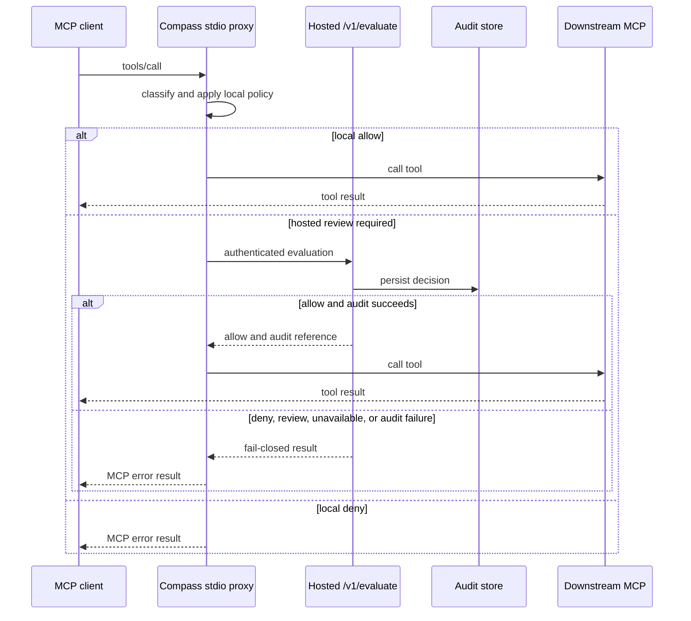

# Application Foundation Map

## Observation Boundary

This is a maintainer-facing map of repository behavior observed at commit
`9a3d42b18189cfd80ebcf40acc36166cf327495b`. It records what source code,
composition roots, configuration, and representative evidence demonstrate at
that commit. It is not a product specification, deployment report, roadmap, or
implementation plan.

`docs/PRODUCT_CONSTITUTION.md` remains the canonical source for Compass product
intent. In particular, its execution-firewall vision includes capabilities that
are not necessarily active in the runtime paths described here. A module,
environment variable, Anchor configuration, or historical runbook is not proof
that a capability is currently deployed or reachable from a live request path.

Each entry in this document uses three independent status axes:

| Axis | Values | Meaning |
| --- | --- | --- |
| Reachability | `active`, `unwired`, `independent-runtime` | Whether an active JavaScript composition root reaches the capability, whether it is a standalone library, or whether it is deployed independently. |
| Evidence | `automated`, `env-gated`, `manual`, `none` | The strongest representative evidence recorded for the described behavior. |
| Operational state | `functional`, `degraded`, `placeholder`, `unknown-live` | Behavior supported by the source path, a known limitation, an intentional unavailable implementation, or an unverified live state. |

The document's common fields are:

```text
ApplicationFoundation entry
  observedAtCommit
  subsystem
  runtimeBoundary
  reachability
  evidence
  operationalState
  canonicalReferences
```

Live state is `unknown-live` unless a dated execution record proves otherwise.
Source configuration and automated local tests establish neither current
deployment nor external service health.

## Runtime Boundaries

The repository has four executable boundaries. They are separate deployment or
execution units, not one monolithic runtime.

| Boundary | Entrypoints and role | Reachability | Evidence | Operational state | Canonical references |
| --- | --- | --- | --- | --- | --- |
| Next.js | Root JSON response, redirects, raw HTML routes, pitch page, and the adapter that invokes the hosted API. | `active` | `automated` | `functional` | `app/route.ts`, `app/api/hosted/[...route]/route.ts`, `app/route.test.ts` |
| Hosted API | Hono application hosted through the Next adapter or `Bun.serve`; owns authenticated `/v1` routes, evaluation, audit, verification, mandates, and policy routes. | `active` | `automated` | `functional` | `hosted/app.ts`, `hosted/server.ts`, `hosted/app.test.ts` |
| MCP proxy | Node stdio executable that mirrors one downstream MCP server and intercepts `tools/call`. | `active` | `automated` | `functional` | `back/services/mcp/server/mcpServer.ts`, `back/services/mcp/proxy/mcpProxyDispatcher.ts`, `back/services/__tests__/mcpServer.test.ts` |
| Anchor workspaces | Devnet AgentActionGuard and ConditionalEscrowBuy programs with independent Rust and Anchor configuration. | `independent-runtime` | `automated` | `unknown-live` | `back/solana/agent-action-guard/`, `back/solana/conditional-escrow-buy/` |

### Next.js Boundary

- `GET /` returns a JSON service-discovery response; it is not a product
  homepage (`app/route.ts`).
- `app/api/hosted/[...route]/route.ts` caches a Hono app, removes the
  `/api/hosted` prefix, and delegates HTTP methods to it. The route sets a
  15-second maximum duration for hosted confirmation polling.
- `/landing` redirects to the external public site; `/demo` and `/launch`
  stream root-level HTML files; `/pitch` renders the React/Remotion pitch
  surface (`app/landing/route.ts`, `app/demo/route.ts`, `app/launch/route.ts`,
  `app/pitch/page.tsx`).
- The public-document registry serves only explicitly registered Markdown under
  `public/`. This map is intentionally absent from it and remains internal
  (`app/docs/registry.ts`).

### Hosted Hono Boundary

- `createHostedApp` composes an in-memory audit store by default, policy and
  evaluation services, verification services that share one verdict store,
  credential and waitlist stores, and mandate routes (`hosted/app.ts`).
- Health, beta-click, signup, and waitlist routes mount before the `/v1/*`
  authentication middleware. Authenticated `/v1` routes include evaluation,
  verification, mandates, audit lookup, and policy routes (`hosted/app.ts`,
  `hosted/http/hostedAuthMiddleware.ts`).
- The standalone host uses `COMPASS_HOSTED_PORT`, then `PORT`, then `3001`
  (`hosted/server.ts`). The Vercel/Next adapter is an alternative host for the
  same factory rather than a separate API implementation.

### Node Stdio MCP Boundary

- The published package exposes `dist/mcpServer.js` as
  `compass-mcp-guard`; the direct entrypoint starts an SDK server over stdio
  (`package.json`, `back/services/mcp/server/mcpServer.ts`).
- Downstream `tools/list` is authoritative. The proxy does not expose a native
  Compass tool registry or static tool schemas.
- The server starts one configured downstream stdio MCP client and creates a
  hosted evaluation client only when both the hosted URL and API key are
  available (`back/services/mcp/config/mcpRuntimeConfig.ts`,
  `back/services/mcp/server/mcpServer.ts`).

### Independent Anchor Boundary

- `back/solana/agent-action-guard/` and
  `back/solana/conditional-escrow-buy/` each have their own Anchor workspace,
  Cargo workspace, program source, and devnet configuration.
- These programs are not TypeScript imports of the Next, Hono, or MCP
  composition roots. Their source and Rust tests demonstrate independent
  program behavior, not that an active JavaScript request invokes them.

## Active Guarded MCP Call Flow

The active protected execution path is the stdio proxy plus hosted
`POST /v1/evaluate`. The downstream MCP executes a tool only after the local
interceptor allows it or hosted evaluation returns `allow` and audit persistence
succeeds.



### Local Interception and Downstream Gate

`createProxyDispatcher` evaluates local policy before calling its injected
downstream executor (`back/services/mcp/proxy/mcpProxyDispatcher.ts`).

- Local `deny` returns a denial without calling downstream execution.
- Local `allow` can execute only when an execution dependency exists. Its
  absence returns a fail-closed denial.
- A review-required call without a hosted client returns a fail-closed denial
  with the required configuration names.
- Hosted `deny` and `review` never reach `executeTool`; only hosted `allow`
  does.
- Downstream discovery, safe-method forwarding, and execution errors are
  converted into explicit unavailable or denial results rather than implicit
  permission.

Representative automated coverage: `back/services/__tests__/mcpProxyDispatcher.test.ts`,
`back/services/mcp/proxy/mcpHostedClient.test.ts`, and
`back/services/__tests__/hybrid-e2e.test.ts`.

### Hosted Evaluation and Audit Gate

`createEvaluationService` combines optional LLM routing, deterministic policy,
an advisory LLM decision, and audit persistence (`hosted/evaluate/evaluationService.ts`).

- Router `skip` returns a low-risk allow candidate; transfer and swap
  classifications derive policy context and run deterministic policy.
- The advisory decision is clamped so it cannot relax the deterministic
  decision (`hosted/llm/llmDecisionAdapter.ts`,
  `shared/types/llmDecisionContracts.ts`).
- Evaluation writes the final audit record before returning. An audit-write
  failure returns `deny`, high risk, and `AUDIT_DEGRADED_DENIAL`.
- The default audit implementation is in-memory. This is active runtime
  behavior, but it is not evidence of durable production audit storage
  (`hosted/audit/auditStore.ts`).

Representative automated coverage: `hosted/evaluate/evaluationService.test.ts`
and `hosted/app.test.ts`.

## Capability Inventory

The inventory is ordered by composition-root reachability, not by the number of
source files or tests associated with a capability.

| Capability | Runtime boundary | Reachability | Evidence | Operational state | Observed behavior and references |
| --- | --- | --- | --- | --- | --- |
| MCP discovery and interception | Node stdio | `active` | `automated` | `functional` | Mirrors downstream discovery, classifies calls locally, and gates sensitive calls through hosted evaluation. `back/services/mcp/server/mcpServer.ts`; `back/services/mcp/proxy/mcpProxyDispatcher.ts`. |
| Hosted evaluation and audit gate | Bun/Hono | `active` | `automated` | `functional` | Evaluates routed calls, clamps advisory decisions, and denies when the audit write fails. `hosted/evaluate/evaluationService.ts`; `hosted/audit/auditStore.ts`. |
| Hosted authentication and credentials | Bun/Hono | `active` | `automated` | `functional` | Authenticates `/v1/*` with a configured shared key or stored per-email credential. `hosted/http/hostedAuthMiddleware.ts`; `hosted/credential/`. |
| Intended-effect verification | Bun/Hono | `active` | `automated` | `functional` | Persists the intended effect and policy context for later confirmation. `hosted/verify/verifyService.ts`; `hosted/verify/verifyService.test.ts`. |
| Actual-effect confirmation | Bun/Hono | `active` | `automated` | `placeholder` | The default composition injects `deriveActualEffectUnavailable`, so confirmed transactions cannot produce decoded match or mismatch results. `hosted/app.ts`; `hosted/verify/deriveActualEffect.unavailable.ts`. |
| Transfer gateway and wallet safety | Solana library | `unwired` | `automated` | `functional` | Candidate, policy, wallet-fact, list, and proposal behavior exist in tested libraries but no active composition root imports them. `back/services/domains/transfer/transferGateway.ts`; `back/services/domains/transfer/walletSafetyValidation.ts`. |
| Swap gateway | Solana library | `unwired` | `automated` | `functional` | Tested candidate, quote, policy, and proposal logic is not mounted in the active MCP or hosted roots. `back/services/domains/swap/swapGateway.ts`. |
| Conditional action gateway | Solana library | `unwired` | `automated` | `functional` | Tested price, oracle, expiry, and slippage policy logic is not mounted in an active root. `back/services/domains/conditional-parking-lot/conditionalGateway.ts`. |
| Local signer and SOL payload builder | Solana library | `unwired` | `automated` | `functional` | Devnet-constrained local signing and unsigned SOL transfer construction are standalone modules. `back/services/support/signer/signerAdapter.ts`; `back/services/solana/transactions/transferTransactionPayload.ts`. |
| Orca USDC/SOL quote path | Solana library | `unwired` | `automated` | `degraded` | Supports the fixed devnet pair and can use a configured fallback price. `back/services/solana/price-providers/orcaUsdcSol.ts`; `back/services/solana/providers/priceQuote.ts`. |
| On-chain approval verifier | Solana library | `unwired` | `automated` | `functional` | Reads approval and attestation accounts and verifies guarded-transfer proof, but is not composed into active request roots. `hosted/onchain/onchainApproval.ts`. |
| AgentActionGuard program | Anchor workspace | `independent-runtime` | `automated` | `unknown-live` | Devnet program source enforces policy, approval, and attestation checks independently of JavaScript composition. `back/solana/agent-action-guard/programs/agent-action-guard/src/lib.rs`. |
| ConditionalEscrowBuy program | Anchor workspace | `independent-runtime` | `automated` | `unknown-live` | Separate devnet escrow program and Rust test suite. `back/solana/conditional-escrow-buy/programs/conditional-escrow-buy/src/lib.rs`. |

The AgentActionGuard TypeScript integration scaffold is not execution evidence:
all its guarded-transfer cases are skipped
(`back/solana/agent-action-guard/tests/guarded-transfer.ts`).

## Integrations and Degraded Behavior

The following entries distinguish code-level configuration from current live
availability. Environment names are inventory references, not values to expose
or commit.

| Integration | Configuration and invocation | Fallback or degraded behavior | Reachability | Evidence | Operational state |
| --- | --- | --- | --- | --- | --- |
| Downstream MCP | CLI JSON/configuration and selected environment forwarded by the stdio proxy. | Missing or unavailable downstream produces an empty tool list or explicit denial/error. | `active` | `automated` | `functional` |
| Hosted evaluator | `COMPASS_HOSTED_API_URL`, `COMPASS_HOSTED_API_KEY`, and `COMPASS_HOSTED_TIMEOUT_MS`; called by the proxy for review-required tools. | Missing client, timeout, network, auth, malformed body, `deny`, or `review` fails closed. | `active` | `automated` | `functional` |
| Hosted auth | `COMPASS_HOSTED_API_KEY` plus stored credentials from signup. | Missing, revoked, malformed, or store-error credentials return the same unauthenticated response. | `active` | `automated` | `functional` |
| Postgres/Supabase | `COMPASS_VERDICT_DB_URL` selects durable stores for verdicts, credentials, mandates, and waitlist. | Non-production uses in-memory stores when absent; production composition rejects a missing URL. | `active` | `env-gated` | `unknown-live` |
| Solana RPC | `SOLANA_RPC_URL`, defaulting to devnet in the shared connection helper. | Confirmation uses a bounded retry budget; unavailable confirmation remains retryable. | `unwired` | `automated` | `unknown-live` |
| LLM router and judge | `COMPASS_LLM_ROUTER_*` and `COMPASS_LLM_*` settings. | Router failure becomes `unknown`; absent or invalid advisory output cannot loosen deterministic policy. | `active` | `automated` | `functional` |
| Verify judge | `COMPASS_VERIFY_JUDGE_ENABLED` and the LLM settings. | Does not run without eligible mandate, purpose, and configuration. | `active` | `automated` | `functional` |
| PostHog | `POSTHOG_API_KEY` and `POSTHOG_HOST`; used by MCP and hosted evaluation telemetry. | Telemetry capture failure does not relax an otherwise audited decision. | `active` | `automated` | `unknown-live` |
| Orca | Fixed devnet USDC/SOL configuration plus `FALLBACK_SOL_USD_PRICE`. | The normalized quote facade enables environment-priced fallback unless disabled at the lower layer. | `unwired` | `automated` | `degraded` |
| Vercel | `vercel.json` rewrites public hosted API paths into the Next adapter. | Source configuration is not proof of a current deployment. | `active` | `none` | `unknown-live` |

The consolidated configuration inventory is `.env.example`. It includes devnet
Solana, local signer, LLM, analytics, hosted API, and database variables. The
documented default states and fallbacks are source behavior; they do not confirm
external credentials, provider reachability, or deployment state.

## Evidence Status

Evidence classes must remain distinct:

| Evidence class | Repository examples | What it establishes | What it does not establish |
| --- | --- | --- | --- |
| Automated unit or contract | Vitest suites under `app/`, `back/`, and `hosted/`; embedded Anchor Rust tests. | Local behavior of tested modules and injected composition. | Deployed integration health or end-to-end external state. |
| Automated process integration | `back/services/__tests__/hybrid-e2e.test.ts`; `scripts/e2e-pipeline-test.mjs`. | Local process routing with fixtures or a locally started host. | A production downstream MCP, deployment, or chain state. |
| Environment-gated live | Hosted verify, Postgres, Solana, and LLM live suites. | Behavior only when the required environment is intentionally supplied and the suite runs. | Evidence when variables are absent or the suite has not run. |
| Skipped scaffold | `back/solana/agent-action-guard/tests/guarded-transfer.ts`. | Intended coverage shape. | Executed Anchor integration behavior. |
| Historical manual | Wave runbooks and dated LLM-result reports under `docs/`. | A recorded past observation on its documented date. | Current repository, deployment, or provider state. |
| Source configuration only | `vercel.json`, `.vercel/project.json`, Anchor TOML, and `.env.example`. | Intended configuration and runtime boundaries. | A current deployment, configured secret, or reachable service. |

`package.json` provides `build`, `lint`, Vitest, hosted development, MCP,
pipeline-E2E, and Remotion commands. It does not define a dedicated typecheck
script. The Next build configuration ignores TypeScript and ESLint errors during
(`package.json`, `next.config.mjs`).

## Frontend and Documentation Surfaces

Frontend surfaces share some visual motifs but do not form a single global
application shell or design system.

| Surface | Serving boundary | Reachability | Evidence | Operational state | References |
| --- | --- | --- | --- | --- | --- |
| Root API response | Next route returning JSON. | `active` | `automated` | `functional` | `app/route.ts`, `app/route.test.ts` |
| `/demo` and `/launch` | Next route handlers stream root `demo.html` and `launch.html`. | `active` | `none` | `functional` | `app/demo/route.ts`, `app/launch/route.ts` |
| `/pitch` | React page loads the Remotion player composition. | `active` | `none` | `functional` | `app/pitch/page.tsx`, `app/pitch/PitchDeckClient.tsx`, `app/pitch/remotionRoot.tsx` |
| `/landing` | Redirect to the external public site. | `active` | `none` | `unknown-live` | `app/landing/route.ts` |
| Public documentation | Explicit registry reads Markdown from `public/`. | `active` | `none` | `functional` | `app/docs/registry.ts`, `app/docs/[slug]/route.ts` |
| This foundation map | Root `docs/` maintainer document, not a public route input. | `active` | `manual` | `functional` | `docs/application-foundation.md`, `app/docs/registry.ts` |

There are no browser-rendering, visual-regression, screenshot, or responsive
layout suites in the inspected configuration. Remotion scripts support local
studio and rendering but are not visual test evidence (`package.json`).

## Findings and Unknowns

- The active MCP/hosted path represents transfer and swap through generic tool
  classification and policy context. It does not import the specialized
  transfer, wallet-safety, swap, conditional, signer, Orca, or on-chain
  approval modules.
- The default verification composition intentionally injects an unavailable
  actual-effect decoder. Confirmed transactions therefore remain unable to
  produce default decoded match or mismatch outcomes.
- The two Anchor workspaces are configured for devnet but remain independent
  deployment units. Source does not establish a currently deployed program,
  funded account, or invoking JavaScript path.
- The AgentActionGuard Rust declaration and Anchor configuration identify one
  program address, while `docs/onchain-deployments.md` records a different
  address. The inspected source does not establish which address, if any, is
  currently deployed.
- The repository holds Vercel, Postgres, LLM, PostHog, RPC, and MCP
  configuration. No claim here treats those settings as proof that a current
  external integration is live.
- Historical manual evidence is retained as historical evidence only. Its date,
  environment, and scope govern what it can support.

## Canonical References

Use these source families to validate or refresh material claims in this map:

- Product intent: `docs/PRODUCT_CONSTITUTION.md`.
- Next and Vercel boundary: `app/route.ts`, `app/api/hosted/[...route]/route.ts`,
  `app/docs/registry.ts`, and `vercel.json`.
- Hosted composition and policy: `hosted/app.ts`, `hosted/appContracts.ts`,
  `hosted/evaluate/`, `hosted/policy/`, `hosted/http/`, and `hosted/verify/`.
- MCP composition and fail-closed dispatch: `back/services/mcp/server/mcpServer.ts`,
  `back/services/mcp/proxy/`, and `back/services/mcp/config/`.
- Shared contracts: `shared/types/` and `back/guardrail/`.
- Specialized libraries: `back/services/domains/`,
  `back/services/solana/`, and `back/services/support/signer/`.
- On-chain programs: `back/solana/agent-action-guard/` and
  `back/solana/conditional-escrow-buy/`.
- Configuration and operational scripts: `.env.example`, `package.json`, and
  `scripts/`.
- Representative automated evidence: `hosted/app.test.ts`,
  `hosted/evaluate/evaluationService.test.ts`,
  `back/services/__tests__/mcpProxyDispatcher.test.ts`, and
  `back/services/__tests__/hybrid-e2e.test.ts`.

## Review Checklist

When updating this map for a later commit:

- Record the commit inspected and distinguish product intent from repository
  evidence.
- Trace each active claim from a composition root through its relevant
  dependency or route, then cite representative automated evidence.
- Give every capability separate reachability, evidence, and operational-state
  labels; do not present unwired or configured-only components as active/live.
- Keep deployed and external-service state `unknown-live` without dated direct
  execution evidence.
- Confirm the map remains unregistered from `app/docs/registry.ts` and has no
  mirrored public or OpenSpec copy.
